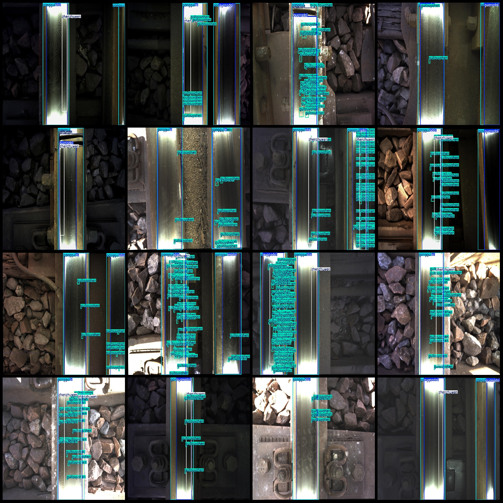
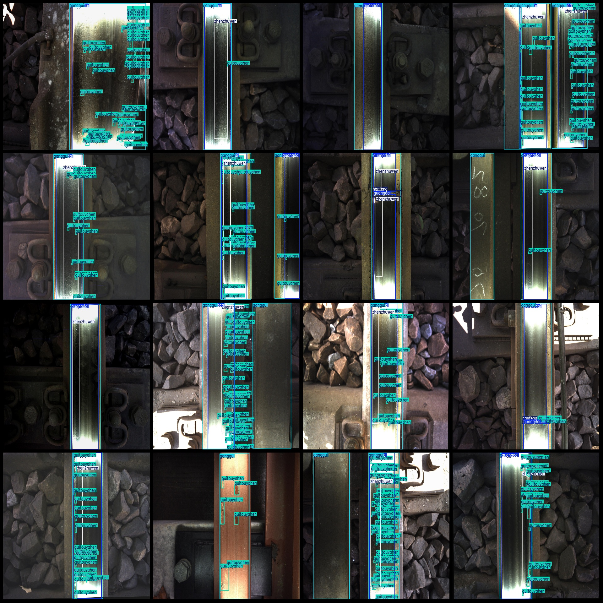

# Intelligent Railway Patrol and Track Inspection Data Set with Train Defect Detection in VOC+YOLO Format, 1464 Images, 6 Categories

Dataset format: Pascal VOC format+YOLO format (without split path's txtfile, only contain jpgimage and corresponding VOC format xmlfile and yolo format txtfile)
number of images: 1464  
annotation count: 1464  
annotation count: 1464  
annotationnumber of classes: 6  
Annotation class names: ["Ganggui", "Guangdai", "Guitouyahen", "Hanfeng", "Ruibian", "Zhenzhuwen"]  
["Rail", "Greystripe", "Railhead indentation", "Weld", "Sharp corner", "Pearl pattern"]
Guitouyahen → Wheel pressure marks/wear formed at the top of the rail  
Guangdai → Bright stripe formed by the wheel contact with the rail top surface, reflecting the contact status  
Zhenzhuwen → Fine textures on the surface of the rail resembling pearl luster, mostly caused by contact fatigue  
Ganggui → The main body of railway tracks  
Hanfeng → Weld joint of rails  
Ruibian → Sharp burrs or sharp edges at the edge of rails
boxes per class:   
ganggui box count = 2059  
guangdai box count = 1909  
guitouyahen box count = 24238  
hanfeng box count = 107  
ruibian box count = 108  
zhenzhuwen box count = 1276  
total boxes: 29697  
images per class:   
ganggui images = 1461  
guangdai images = 1437  
guitouyahen images = 1332  
hanfeng images = 107  
ruibian images = 108  
zhenzhuwen images = 1039  
image resolution: 2048x1536  
Use annotation tool: labelImg
Annotation rules: draw a rectangle around the class
Important notes: The dataset does not have a division of training, validation, and test sets. You need to divide them yourself.
Special statement: This dataset does not guarantee any accuracy in the model or weight file trained.
Image preview:
## Images

Here is a pay link on Stripe ( https://buy.stripe.com/3cs8yP7sY87d0vu9AB ). Please contact me lonlonago@foxmail.com after funding $89, and I will send you a complete data files , thank you!

